<!-- Remplace header.png par ton image pixel art uploadée dans le repo -->

  

# `Johan BILE Kouamé`
`// Data Science · AI · Data Engineering`

 

 

&nbsp;

&nbsp;

---

### 📊 GitHub Analytics

&nbsp;

 

---

### 📅 Isometric Commit Calendar

<!-- Généré automatiquement par le GitHub Action lowlighter/metrics -->

---
### 🎟️ Issues & Pull Requests

  

---

### 👨‍💻 About

> Étudiant en **Data Science & IA** à **IA School Lille**, passionné par la transformation de données brutes en insights actionnables.
> À la recherche d'une **alternance** en Data / IA.

---

### ⚡ Tech Stack

**Languages & Query**

**Databases**

**DevOps & Tools**

---

### 🚀 Featured Projects

| Project | Description | Stack |
|---------|-------------|-------|
| [**ObRail Europe**](https://github.com/JXPM) | Pipeline ETL · API REST pour flux ferroviaires européens | `FastAPI` `PostgreSQL` `Docker` `CI/CD` |
| [**Chatbot IT**](https://github.com/JXPM) | Assistant conversationnel NLP via OpenAI API + Flask | `Python` `Flask` `OpenAI` `JS` |
| [**Projet GEMA**](https://github.com/JXPM) | Architecture BDD & gouvernance des données pour J&M Écodigital | `SQL` `Modeling` `PM` |
| [**Site Fingec**](https://github.com/JXPM) | Personnalisation full-stack avec charte graphique sur mesure | `MySQL` `PHP` `CSS` |

---

### 🎓 Certifications

---

### 📬 Connect

&nbsp;

&nbsp;

 
